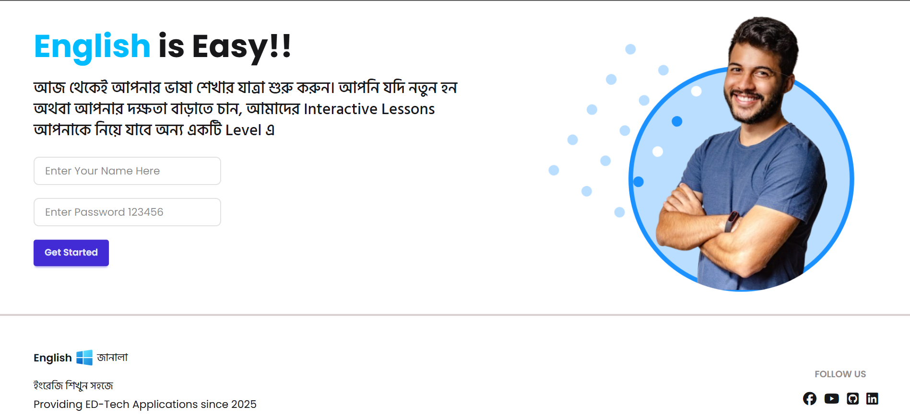
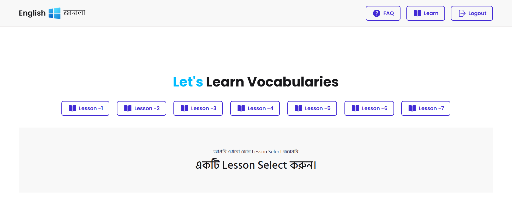
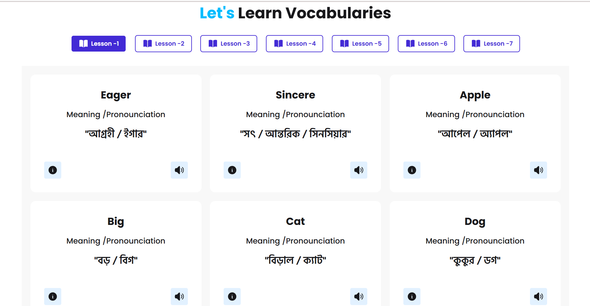
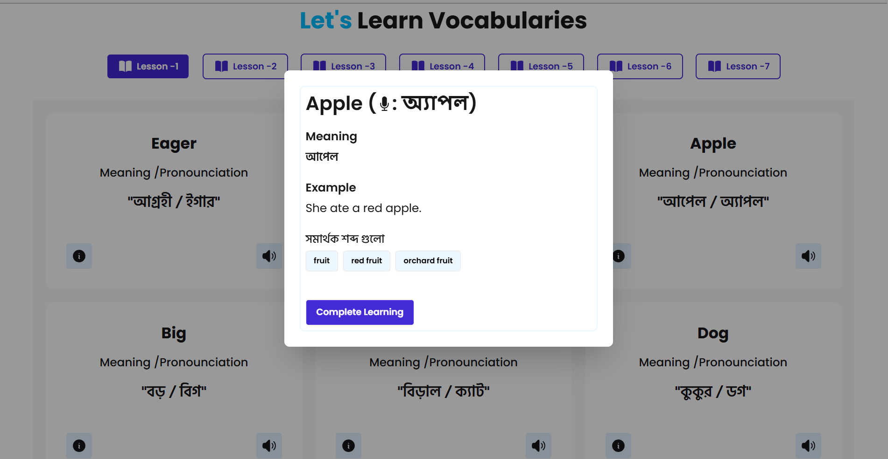
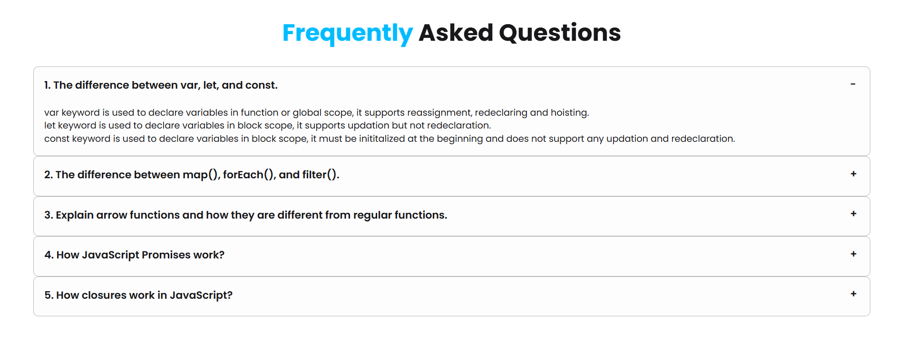

# 🪟 English Janala

**English Janala** is an interactive and beginner-friendly vocabulary learning web application. It fetches categorized lessons and word details dynamically from an open API. The app provides features like level-wise vocabulary learning, pronunciation support, and detailed modal views of each word, all within a sleek styled UI with Tailwind CSS and DaisyUI.

---

## 🌐 Live Demo

Click [Language-Bridge-Your-Gateway-to-English
](https://tamimmuntakim.github.io/Language-Bridge-Your-Gateway-to-English/) to view the live demo.

---

## 📁 Project Structure

```
Language-Bridge-Your-Gateway-to-English/
├── index.html
├── scripts/
│   └── script.js
├── assets/
│   ├── logo.png
│   ├── hero-student.png
│   ├── alert-error.png
│   └── screenshots/
│       ├── login-section.png
│       ├── dashboard.png
│       ├── lesson.png
│       ├── word-modal.png
│       └── faq.png
├── README.md
```

---

## 🚀 Features

- 🔐 **Login System**: Simple login with a preset password (`123456`) to unlock content.
- 📚 **Vocabulary Levels**: Choose from multiple "Lessons", each representing a different vocabulary level.
- 🔤 **Word Details Modal**: Learn each word's meaning, pronunciation, example usage, and synonyms.
- 🔊 **Text-to-Speech Pronunciation**: Click to hear how each word is pronounced.
- 🔄 **Loader & UI Feedback**: Responsive design with loading indicators and error feedback.
- ❓ **FAQs Section**: Learn about JavaScript concepts through the built-in FAQ accordion.

---

## 🛠️ Technologies Used

- **HTML5**
- **JavaScript**
- **Tailwind CSS**
- **DaisyUI**
- **SweetAlert2**
- **Open API** from [programming-hero.com](https://openapi.programming-hero.com/)

---

## 🔐 How to Use

1. Clone the repository:
   ```bash
   git clone https://github.com/your-username/english-janala.git
   cd english-janala
   ```

2. Open `index.html` directly in a browser, or use a local server (e.g. with VSCode Live Server).

3. Enter your **name** and use password `123456` to log in.

4. Choose a vocabulary lesson and start learning new words interactively.

---

## 🧪 API Endpoints Used

- `GET /api/levels/all` – Fetches all vocabulary levels.
- `GET /api/level/{levelID}` – Fetches all words in a specific lesson.
- `GET /api/word/{wordID}` – Fetches detailed information for a single word.

---

## 🖼️ Screenshots

## 🔐 Login Page


## 🏠 Dashboard View


## 📚 Lesson Selection


## 🔤 Word Detail Modal


## ❓ FAQ Section


---

## 📌 Notes

- Only the password `123456` allows login.
- This is an educational project to demonstrate the integration of frontend UI with a REST API.
- The site is responsive and mobile-friendly.

---

## ✨ Credits

- Icons from [Heroicons](https://heroicons.com/) and [Icons8](https://icons8.com/)
- Fonts from [Google Fonts](https://fonts.google.com/)
- SweetAlert2 for beautiful alert dialogs

---

## 📄 License

This project was developed as an educational tool to help native Bengali speakers learn English vocabulary in easier and interactive approach.